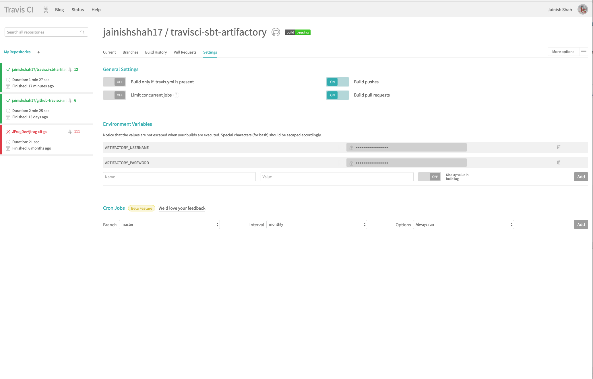
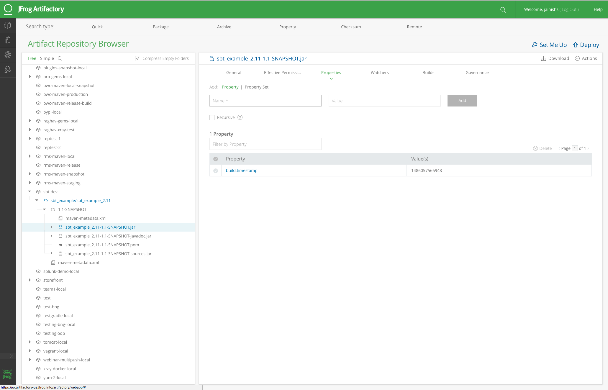

[](https://travis-ci.org/Shahbrothers/travisci-sbt-artifactory)


## Artifactory Integration with Travis-CI

`To make this integration  work you will need to have running Artifactory-pro/Artifactory SAAS.`

#### SBT Example
This is a sample project that resolve a dependency from Artifactory and deploys the build artifacts to Artifactory.

Step 1:

copy ```.travis.credentials.sh``` and ```.travis.yml``` file to your project.

`Note: Change your hostname in  .travis.credentials.sh and build.sbtaccrodingly` 

Step 2: 

Enable your project in [travis-ci](https://travis-ci.org/) .


Step 3:

add Environment Variables ARTIFACTORY_USERNAME and ARTIFACTORY_PASSWORD in build settings of travis-ci.



Step 4:

Trigger build.

Step 5: 

You should be able to see published artifacts in artifactory.



